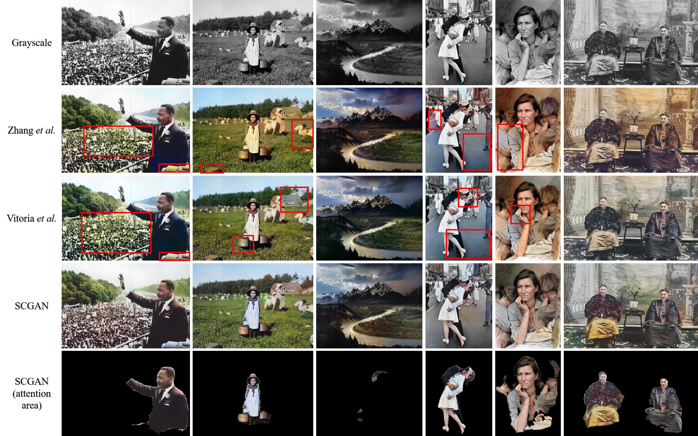
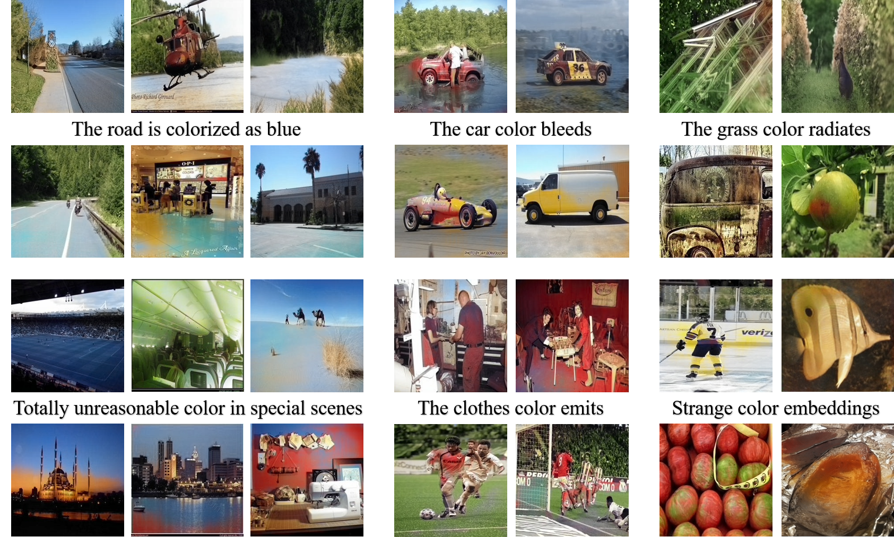
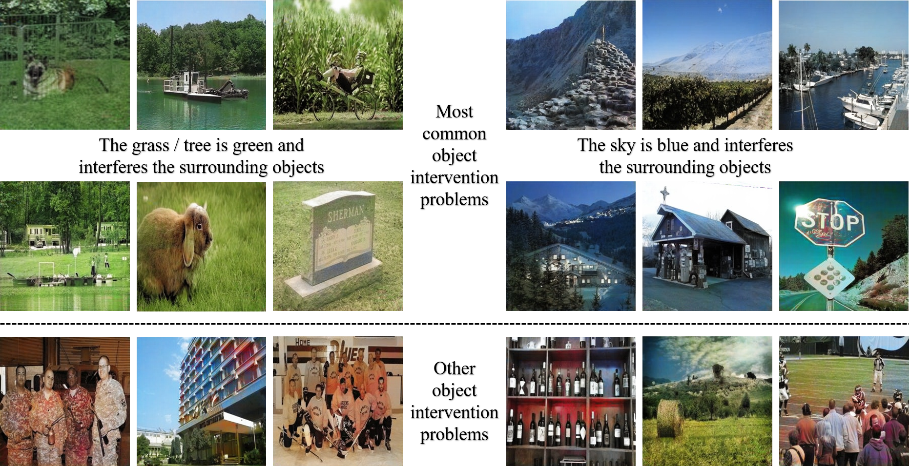
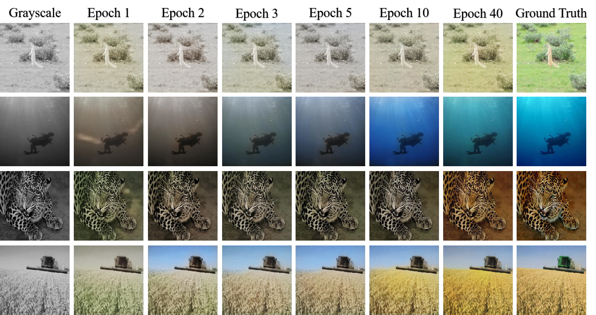
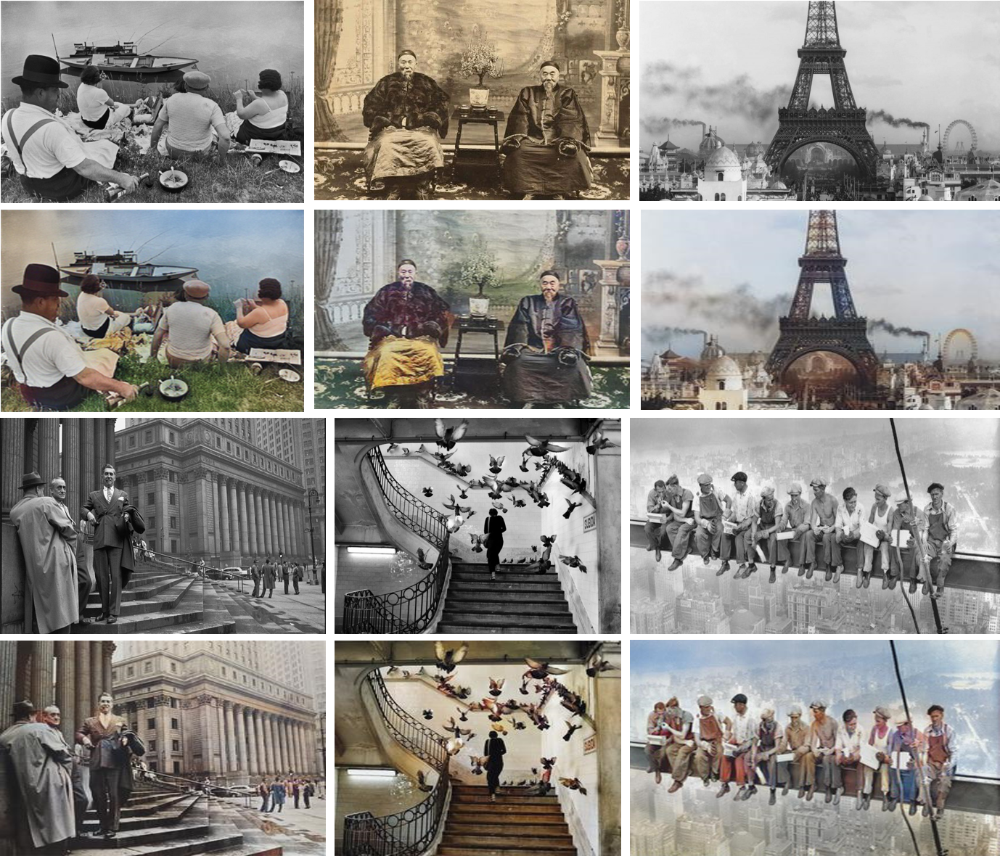

# Semantic-Colorization-GAN

This page is for paper **SCGAN: Saliency Map-guided Colorization with Generative Adversarial Network** pubished on IEEE Transactions on Circuits and Systems for Video Technology (TCSVT).

Early access: https://ieeexplore.ieee.org/document/9257445/keywords#keywords

## 1 Training

We release the training code in **train** folder and **train on multispectral images** folder (for colorizing multispectral images).

The codes require following libs:

- Python=3.6
- PyTorch>=1.0.0
- torchvision>=0.2.1
- Cuda>=8.0
- opencv-python>=4.4.0.46

## 2 Evaluation

Please refer to **evaluation** folder.

## 3 Testing Examples

### 3.1 Colorization Results

We show the representative image of our system.




We provide a lot of results randomly selected from **ImageNet** and **MIT Place 365** validation datasets. These images contain multiple scenes and colors.


### 3.2 Comparison Results

The comparison results with other fully-automatic algorithms are:


The comparison results with other example-based algorithms are:


### 3.3 Examples of Semantic Confusion and Object Intervention Problems

We give some examples to illustrate the semantic confusion and object intervention problems intuitively. The SCGAN intergrates the low-level and high-level semantic information and understands how to genrate a reasonable colorization. These settings / architectures help the main colorization network to **minimize the semantic confusion and object intervention problems**.

There is some examples of semantic confusion problem.



There is some examples of object intervention problem.



To further prove this point, we give more examples about generated attention region and how the saliency map works.


### 3.4 How our Model Learns at each Epoch

In order to prove our system has the strong fitting ability, we plot the evolution of results of multiple epochs of pre-training term and refinement term. We can see the CNN learns the high-level information at second term.



## 4 Legacy Image Colorization

### 4.1 Portrait Photographs

We choose several **famous legacy portrait photographs** in our experiments. The photographs chosen are with different race, gender, age, and scene. We also select a photo of Andy Lau, which represents the contemporary photographs.


### 4.2 Landscape Photographs

We choose many **landscape photographs** by Ansel Adams because the quality is so good. While these photographs are taken from US National Archives (Public Domain).


### 4.3 Famous Lagacy Photographs

In this section, we select some **famous photographs** (especially before 1950). And we give a color version of them.


### 4.4 Other Works

There are many fantastic **legacy photography works**. Our colorization system still predicts visually high-quality reasonable colorized images.



## 5 Related Projects
**Automatic Colorization: [Project](https://tinyclouds.org/colorize/)
[Github](https://github.com/Armour/Automatic-Image-Colorization)**

**Learning Representations for Automatic Colorization: [Project](http://people.cs.uchicago.edu/~larsson/colorization/)
[Paper](https://arxiv.org/abs/1603.06668)
[Github](https://github.com/gustavla/autocolorize)**

**Colorful Image Colorization: [Project](http://richzhang.github.io/colorization/)
[Paper](https://arxiv.org/abs/1603.08511)
[Github](https://github.com/richzhang/colorization)**

**Let there be Color!: [Project](http://iizuka.cs.tsukuba.ac.jp/projects/colorization/en/)
[Paper](http://iizuka.cs.tsukuba.ac.jp/projects/colorization/data/colorization_sig2016.pdf)
[Github](https://github.com/satoshiiizuka/siggraph2016_colorization)**

**Pix2Pix: [Project](https://phillipi.github.io/pix2pix/)
[Paper](https://arxiv.org/pdf/1611.07004.pdf)
[Github](https://github.com/phillipi/pix2pix)**

**CycleGAN: [Project](https://junyanz.github.io/CycleGAN/)
[Paper](https://arxiv.org/pdf/1703.10593.pdf)
[Github](https://github.com/junyanz/CycleGAN)**

## 6 Reference

If you think the paper is helpful for your research, please cite:
```bash
@article{zhao2020scgan,
  title={SCGAN: Saliency Map-guided Colorization with Generative Adversarial Network},
  author={Zhao, Yuzhi and Po, Lai-Man and Cheung, Kwok-Wai and Yu, Wing-Yin and Abbas Ur Rehman, Yasar},
  journal={IEEE Transactions on Circuits and Systems for Video Technology},
  year={2020},
  publisher={IEEE}
}
```

A similar work on mobile phone image enhancement is available in this [webpage](https://github.com/zhaoyuzhi/RAW2RGB-GAN)
```bash
@inproceedings{zhao2019saliency,
  title={Saliency map-aided generative adversarial network for raw to rgb mapping},
  author={Zhao, Yuzhi and Po, Lai-Man and Zhang, Tiantian and Liao, Zongbang and Shi, Xiang and others},
  booktitle={2019 IEEE/CVF International Conference on Computer Vision Workshop (ICCVW)},
  pages={3449--3457},
  year={2019},
  organization={IEEE}
}
```
